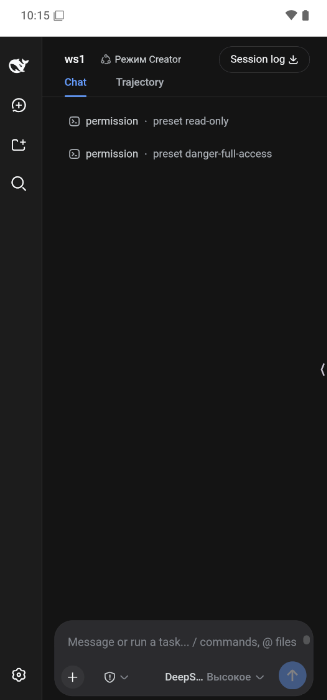
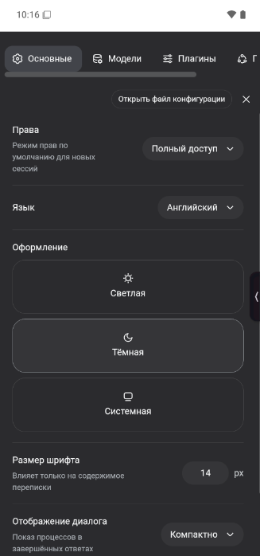

# DSHA — DeepSeek Harness для Android

[](https://github.com/Leostrange/DeepSeek-Harness-Android/releases/latest)
[](https://github.com/Leostrange/DeepSeek-Harness-Android/actions/workflows/android-build.yml)
[](#сборка)
[](#архитектура)
[](#архитектура)
[](https://github.com/deepseek-ai/deepseek-harness)

**proot-песочница с Node-сервером · мобильный интерфейс · русский внутри Harness · всё на самом телефоне**

---

## О проекте

Официальный [DeepSeek Harness](https://github.com/deepseek-ai/deepseek-harness) — агентский веб-интерфейс, который на десктопе живёт в браузере или в [Windows-оболочке](https://github.com/Leostrange/DeepSeek-Harness-Desktop-RU). **DSHA** делает то же самое на Android: запускает `dsh web` (Node-сервер Harness) внутри proot-песочницы прямо на телефоне, открывает его UI в WebView и доводит интерфейс до мобильного вида — шторка сайдбара, полноэкранные настройки, русский перевод, тёмная тема.

Это не отдельный чат и не прокси: внутри работают штатные рабочие области, сессии, режимы, права, модели, плагины и пресеты агентов DeepSeek Harness.

> [!NOTE]
> Неофициальный community-проект. Не является продуктом DeepSeek.

| Скриншот: чат | Скриншот: настройки |
|---|---|
|  |  |

## Возможности

| | Возможность |
|---|---|
| 📱 | Полноценный DeepSeek Harness на телефоне: `dsh web` в proot-песочнице, форграунд-сервис держит сессию |
| 🇷🇺 | Русский интерфейс поверх DSH: словарь + обход shadow-DOM и всплывающих меню, язык приложения `Русский / English / 中文` |
| 🌗 | Темы оформления: светлая / тёмная / системная |
| 🗂 | Рабочие пространства с устройства — выбор папки `/sdcard` через системный SAF-пикер, проброс хранилища в песочницу |
| 🔑 | API-ключ DeepSeek в нативных настройках, передаётся в Harness через `DEEPSEEK_API_KEY` при запуске |
| 🛠 | Мобильные доработки UI: сайдбар-шторка поверх чата, полноэкранные настройки с прокруткой вкладок, «язычок» быстрых кнопок (⚙ / ⏹) |
| 🛡 | Устойчивый запуск: очистка осиротевших процессов, подхват живого сервера, автоперезапуск после сбоя порта |
| ⚙️ | Автосборка debug-APK в GitHub Actions на каждый push |

## Архитектура

```
android/                                  Исходники приложения (Kotlin + Jetpack Compose)
└── app/src/main/java/io/leostrange/dshandroid/
    ├── MainActivity.kt                   UI: WebView, нативные настройки, RU-слой,
    │                                     мобильные CSS/JS-инъекции (фуллскрин-настройки,
    │                                     шторка сайдбара, починка vh-юнитов и грида)
    ├── HarnessForegroundService.kt       Форграунд-сервис: слои загрузки RUNTIME → DSH
    │                                     → NATIVE → UI, запуск `dsh web`, env-ключ,
    │                                     очистка осиротевших процессов
    ├── runtime/
    │   ├── RuntimeInstaller.kt           Установка Termux-совместимого рантайма
    │   ├── ProotRunner.kt                Выполнение команд в proot-песочнице
    │   ├── ProotCommandBuilder.kt        Командная строка proot и окружение
    │   ├── BootstrapLayers.kt            Слои и фингерпринты загрузки
    │   └── NativeBuildConfig.kt          Конфигурация нативной сборки
    └── HarnessRuntimeState.kt            Общее состояние: этап, auth-URL, статус

ci/                                       CI-зеркало: base64-части zip исходников + канонические патчи
qa/                                       Проверка UI через Chrome DevTools Protocol (cdp-eval.js)
docs/                                     План адаптации, найденные корни багов WebView
```

**Ключевые технические решения**

- WebView на Android нетривиален: `100vh`/`100%` могут давать 0px, Radix-поповеры открываются по `pointerdown`, грид-раскладка DSH теряет порядок колонок (чат схлопывается в 0px). Всё чинится JS/CSS-инъекциями до загрузки страницы.
- Интеграция с DSH — файловая: `settings.yaml`, `.credentials.yaml`, `workspace.json` пишутся нативно; сервер подхватывает их при рестарте. Ключ провайдера передаётся через окружение запуска.
- Русский перевод — словарь EN→RU + `MutationObserver` с дебаунсом; при русском языке DSH принудительно держит локаль `en` (переводим своим слоем).

## Сборка

Требования: JDK 17, Android SDK.

```bash
# Windows
cd android
gradlew.bat assembleDebug

# Linux / macOS
cd android
./gradlew assembleDebug
```

Готовый APK: `android/app/build/outputs/apk/debug/app-debug.apk`. Тот же APK собирает [GitHub Actions](https://github.com/Leostrange/DeepSeek-Harness-Android/actions/workflows/android-build.yml) на каждый push (артефакт в истории запусков).

Первый запуск скачивает рантайм и ставит `@deepseek-ai/dsh` (нужен интернет); дальше всё работает локально, кроме запросов к модели.

## Быстрый старт

1. Установите APK, выдайте доступ к хранилищу (запросится при первом старте).
2. Дождитесь загрузки слоёв: RUNTIME → DSH → NATIVE → UI.
3. «Язычок» справа → ⚙ → введите API-ключ DeepSeek → «Сохранить» (Harness перезапустится сам).
4. ⚙ → «Добавить папку рабочего пространства» → выберите папку на устройстве.
5. Пользуйтесь: режимы, права, усилие и модель — как в десктопной версии.

## См. также

- [CHANGELOG.md](CHANGELOG.md) — подробный список всех изменений
- [DeepSeek-Harness-Desktop-RU](https://github.com/Leostrange/DeepSeek-Harness-Desktop-RU) — десктопная Windows-оболочка
- [Mr.Comic](https://github.com/Leostrange/Mr.Comic) — модульный Android-ридер

## Приватность

Всё исполняется на устройстве: сервер живёт в песочнице, сессии и ключи хранятся в приватном каталоге приложения. Ключ API никуда не отправляется, кроме запросов к выбранному провайдеру модели.

---

*Лицензия: все права защищены, код публикуется для личного использования. DeepSeek и DeepSeek Harness — торговые марки их правообладателей.*
